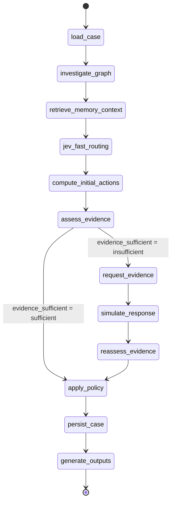

# Agent Workflow

> [[Home]] · [[Architecture]] · [[Policy-Engine]] · [[LLM]] · [[Jev]] · [[TigerGraph]]

## Investigation State Machine (as implemented in `agent/graph.py`)

The agent is a compiled LangGraph `StateGraph` with 12 nodes and one conditional
edge. All TigerGraph access goes through `agent/tg_mcp.py` (MCP-first with a
pyTigerGraph fallback); every node counts `tool_calls` and bumps `step`.

## State Schema

`agent/state.py` defines the full `InvestigationState` TypedDict (all fields
optional for LangGraph partial updates):

| Group | Fields |
|---|---|
| Input | `case_id`, `case_data` (case_pack row + `TransactionID`), `trigger_type` |
| Context | `flagged_txn`, `related_txns` |
| Graph results | `connected_card_ids`, `connected_device_profiles`, `graph_nodes`, `graph_edges` |
| Memory / RAG | `similar_prior_cases`, `rag_context` |
| Assessment | `jev_classification`, `confidence_drivers`, `fraud_probability`, `pattern`, `pattern_description`, `verdict`, `affected_txn_ids`, `first_suspicious_txn_id`, `exposure_usd` |
| Evidence | `evidence` (`claim/source/ref/entity_ids`), `evidence_requests`, `evidence_request_count`, `customer_response` (`""|denied|confirmed|no_reply`) |
| Actions | `initial_actions`, `final_actions`, `what_changed` |
| SAR | `sar_required`, `sar_reason`, `sar_narrative`, `sar_subjects` |
| Outputs | `summary`, `stop_reason`, `written_to_graph`, `graph_case_id` |
| Metadata | `tool_calls`, `tokens`, `latency_s`, `step` |

## Node Definitions (implemented)

### 1. `load_case`
Enriches `case_data` from `case_pack.csv` (card_id, customer_id, risk_score,
trigger_text — module-cached) and fetches the flagged transaction via an
interpreted query through the TG wrapper. If TigerGraph is unreachable it
degrades gracefully to case-pack attributes (risk_score, amount parsed from
trigger text). → 1 tool call.

### 2. `investigate_graph`
Runs the installed queries via `tg_mcp`: `get_transaction_device`,
`get_card_transactions`, `get_card_recent_window` (2h window anchored on the
flagged txn's `ts` for the card-testing signal), `get_shared_device_cards`
(shared-device cards → `connected_card_ids` + `connected_device_profiles` = R6
signal), `get_customer_cards`. Falls back to an interpreted query when the card
is not in the case pack. Builds `graph_nodes`/`graph_edges` for the frontend
(txn, device, card, related txns) and appends one `{"claim","source","ref","entity_ids"}`
evidence entry per fact. Every query attempt increments `tool_calls`.

### 3. `retrieve_memory_context`
`memory.find_similar_cases` (pattern hint from Jev when already available, else
the deterministic heuristic) → `similar_prior_cases`; `rag.retrieve_context` →
`rag_context` plus `document` evidence entries. Adds a `case` node and
`SIMILAR_TO` edges to retrieved `ClosedCase` nodes in the graph viz data.

### 4. `jev_fast_routing`
`classify_fraud_pattern(txn, related_txns, evidence_summary, coordination_facts)`
— real Jev (pattern Choice + sufficiency/coordination Noul) with the
deterministic heuristic fallback. Result stored in `jev_classification`.

### 5. `compute_initial_actions`
Calls `policy.apply_policy` **before** any evidence request, using the prior
probability (transaction risk_score for risk_score triggers, 0.5 for disputes)
and `verdict="uncertain"`. Result stored as `initial_actions` — the §3b
"recommend what the evidence supports now" snapshot.

### 6. `assess_evidence`
LLM synthesis (Groq, temperature 0, JSON mode): calibrated `fraud_probability`
(risk_score is a prior, not the answer), pattern from the fixed enum, verdict,
`affected_txn_ids` validated against the known transaction ids (unknown ids
dropped), `first_suspicious_txn_id`, `confidence_drivers`. Then:
`exposure_usd = Σ abs(amount)` over affected ids only; legitimate → empty list,
exposure 0. Tokens counted from usage.

### 7. Conditional edge `evidence_sufficient`
Sufficient (→ `apply_policy`) when a verification response settled the question,
or fp ≥ 0.85 / ≤ 0.15 with ≥2 independent evidence items (policy §6), or an
evidence-request round already completed. Otherwise insufficient (→ `request_evidence`).

### 8. `request_evidence`
Picks the request type (`customer_validation` for disputes/weak signals,
`step_up_auth` for a strong fraud lean), records
`{"type", "asked_after_step", "assumed_response"}`.

### 9. `simulate_response`
Deterministic simulation: `denied` on strong fraud evidence (fp ≥ 0.70 or
fraud-like pattern), `confirmed` when the case looks like a legitimate recurring
dispute, else `no_reply`. The response becomes `customer`-source evidence and the
assumption is recorded verbatim.

### 10. `reassess_evidence`
LLM re-synthesis with the customer response as new evidence, then deterministic
clamps: confirmed → legitimate, fp ≤ 0.10, empty affected list; denied → fp ≥
0.70, verdict fraud; `no_reply` keeps the verdict uncertain unless independent
evidence already settled it. Exposure recomputed from affected ids.

### 11. `apply_policy`
Deterministic rules R1–R10 + §3a (see [[Policy-Engine]]). Sets `final_actions`
(route + rule-cited reason per action), `sar_required`, `sar_reason`,
`sar_subjects`, and the deterministic `stop_reason`. If no evidence was
requested, `final_actions` are copied into `initial_actions` (final == initial,
`what_changed = "nothing"`).

### 12. `persist_case`
`memory.persist_investigation_case` upserts the `InvestigationCase` vertex and
`INV_INVOLVES` / `INV_ON_CARD` / `INV_CONNECTED_TO` / `SIMILAR_TO` edges →
`written_to_graph`, `graph_case_id`. Failure degrades gracefully to
`written_to_graph: false`.

### 13. `generate_outputs`
LLM writes `summary`, `sar_narrative` (only when `sar_required`), and refines
the `stop_reason` wording. The answer JSON itself is assembled afterwards by
`answer_writer.build_answer` (shared by [[API]] and the CLI).

## Entry Points

| Entry | What it does |
|---|---|
| `agent/main.py <case_id> <txn_id> [trigger]` | CLI: runs the graph, writes `cases/<case_id>.json` |
| `agent/api.py` POST `/investigate` `{case_id, transaction_id, trigger_type}` | Runs the graph in a thread, writes the answer file, returns the full answer JSON (CORS restricted to `http://localhost:3000`) |
| `agent/scripts/run_benchmark.py` | HTTP mode: POSTs each case to `POST {BACKEND_URL}/cases/{id}/trigger` with a 5s delay, then validates `cases/`. `--dry-run`: in-process run against a CSV-backed mock TG + stub LLM, writes and validates the 20 answer files offline |

## Testing

`agent/tests/` (run with `agent\venv\Scripts\python.exe -m pytest agent/tests -q`
from the repo root):

- `test_policy.py` — every rule R1–R10, routes, §3a triggers, R10 guard, legitimate path, R8 escalation
- `test_answer_writer.py` — schema completeness, sar consistency, `what_changed`, initial==final
- `test_flow.py` — full fixture run through the compiled graph with a mocked TG client, stub LLM, and mocked case persistence; asserts exposure, evidence-request loop, SAR consistency, and validator-clean output

All tests run offline (no TigerGraph, no Groq, no Jev — heuristic engine).

## Cross-References

- Policy rules: [[Policy-Engine]]
- TigerGraph queries: [[TigerGraph]]
- LLM prompts: [[LLM]]
- Jev decisions: [[Jev]]
- Answer format: [[PRD]]