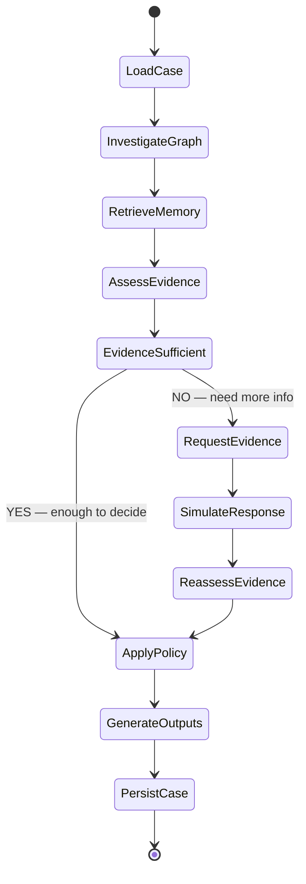

# Agent Workflow

> [[Home]] · [[Architecture]] · [[Policy-Engine]] · [[LLM]] · [[Jev]]

## Investigation State Machine

The agent is a LangGraph state machine with ~10 nodes and conditional edges.



## State Schema

The shared LangGraph state accumulates evidence across nodes:

```python
class InvestigationState(TypedDict):
    # Input
    case_id: str
    case_data: dict               # from case_pack.csv row
    trigger_type: str             # risk_score | customer_report | analyst_request

    # Transaction & entity context
    flagged_txn: dict             # full transaction record
    customer_history: list[dict]  # all txns for this customer
    card_history: list[dict]      # all txns for the flagged card
    device_profile: dict | None   # identity record if online
    related_cards: list[str]      # cards sharing device/region/email
    related_txns: list[dict]      # suspicious txns on related cards

    # Graph investigation results
    graph_evidence: list[dict]    # structured evidence from TG queries
    connected_device_profiles: list[str]
    connected_card_ids: list[str]
    billing_regions: list[dict]
    email_domains: list[dict]

    # Historical memory
    similar_prior_cases: list[dict]  # from closed_cases_history

    # Assessment
    jev_classification: dict      # Jev pattern/sufficiency/coordination
    fraud_probability: float
    pattern: str
    pattern_description: str
    verdict: str                  # fraud | legitimate | uncertain
    affected_txn_ids: list[str]
    first_suspicious_txn_id: str
    exposure_usd: float

    # Evidence requests
    evidence_requests: list[dict]
    evidence_request_count: int
    assumed_responses: list[dict]

    # Actions
    initial_actions: list[dict]
    final_actions: list[dict]
    what_changed: str

    # SAR
    sar_required: bool
    sar_narrative: str
    sar_subjects: list[str]

    # Evidence list for output
    evidence: list[dict]          # claim, source, ref, entity_ids

    # Metadata
    stop_reason: str
    tool_calls: int
    tokens: int
    investigation_step: int       # current step counter
    summary: str
```

## Node Definitions

### 1. `load_case`

**Purpose**: Initialize investigation from case_pack row.

**Inputs**: `case_id` from case_pack.csv
**Actions**:
- Parse case_pack row (trigger_type, flagged_txn_id, card_id, customer_id, risk_score)
- Fetch the flagged transaction from TigerGraph
- Set initial state

**Tools**: `get_transaction(txn_id)` via TG MCP
**Output**: Populated `case_data`, `flagged_txn`
**Next**: → `investigate_graph`

---

### 2. `investigate_graph`

**Purpose**: Gather evidence from TigerGraph graph traversal.

**Inputs**: `flagged_txn`, `case_data`
**Actions**:
- Get customer's full transaction history (all cards)
- Get flagged card's transaction history
- Get device profile (if online transaction, join identity.csv)
- Find other cards sharing same device profile
- Find other cards in same billing region
- Check email domain connections
- Build NEXT chain (transaction sequence on the card)
- Look for card-testing sequences (3+ small txns → large txn)
- Check for out-of-region activity
- Calculate deterministic features (velocity, amount anomaly, region history)

**Tools** (TigerGraph MCP):
- `get_customer_cards(customer_id)` — all cards for customer
- `get_card_transactions(card_id, time_window)` — txn history
- `get_transaction_device(txn_id)` — device profile
- `get_device_neighbors(device_profile)` — other cards using same device
- `get_region_history(card_id)` — billing regions used by card
- `get_card_sequence(card_id, hours)` — recent txn sequence
- `get_email_connections(email_domain)` — cards using same email

**Output**: `graph_evidence[]`, `connected_card_ids`, `connected_device_profiles`, `related_txns`
**Next**: → `retrieve_memory`

---

### 3. `retrieve_memory`

**Purpose**: Find similar prior cases from closed_cases_history.

**Inputs**: `graph_evidence`, `pattern` (preliminary), `customer_id`, `card_id`, device profiles
**Actions**:
- Vector search in TigerGraph for similar closed cases (by customer, card, device, pattern, exposure range)
- Also search by connected cards / shared device profiles
- Retrieve analyst_notes and outcomes
- Identify patterns from prior cases on same customer/card/device

**Tools**:
- `search_similar_cases(query_embedding)` — TigerGraph vector search
- `get_closed_cases_for_card(card_id)` — direct lookup
- `get_closed_cases_for_customer(customer_id)` — direct lookup
- `get_closed_cases_for_device(device_profile)` — cross-customer lookup

**Output**: `similar_prior_cases[]`
**Next**: → `assess_evidence`

---

### 4. `assess_evidence`

**Purpose**: Synthesize all evidence into fraud assessment.

**Inputs**: All graph evidence, similar prior cases, flagged transaction
**Actions**:
- **Jev classification**: pattern, evidence sufficiency, coordination detection
- **LLM reasoning**: synthesize evidence, identify what pattern fits, assess confidence
- Calculate `fraud_probability` (calibrated, not just Jev confidence)
- Identify `affected_txn_ids` (all txns in the fraud episode)
- Calculate `exposure_usd` = sum of |amounts| of affected txns
- Identify `first_suspicious_txn_id`
- Set preliminary `verdict` and `pattern`

**Tools**:
- Jev: `classify_pattern(evidence_state)`, `assess_sufficiency(evidence_state)`, `detect_coordination(evidence_state)`
- LLM: evidence synthesis prompt with structured output

**Output**: `jev_classification`, `fraud_probability`, `pattern`, `verdict`, `affected_txn_ids`, `exposure_usd`
**Next**: → `evidence_sufficient` (conditional edge)

---

### 5. Conditional: `evidence_sufficient`

**Logic**:
```python
def evidence_sufficient(state: InvestigationState) -> str:
    # Stopping conditions from policy section 6
    fp = state["fraud_probability"]
    evidence_count = len(state["evidence"])

    # Clear fraud or clear legitimate with 2+ independent evidence
    if (fp >= 0.85 or fp <= 0.15) and evidence_count >= 2:
        return "apply_policy"

    # Verification response settled it (simulated)
    if state.get("verification_settled"):
        return "apply_policy"

    # Policy R1: weak signal + fp < 0.70 → must verify first
    if fp < 0.70 and evidence_count <= 1 and state["evidence_request_count"] == 0:
        return "request_evidence"

    # Already requested evidence and reassessed
    if state["evidence_request_count"] > 0:
        return "apply_policy"

    # Default: if we have reasonable evidence, proceed
    if evidence_count >= 2:
        return "apply_policy"

    return "request_evidence"
```

---

### 6. `request_evidence`

**Purpose**: Request additional evidence via simulated customer/analyst interaction.

**Inputs**: Current assessment, trigger type, policy rules
**Actions**:
- Determine what evidence to request based on policy:
  - R1: `VERIFY_WITH_CUSTOMER` or `STEP_UP_AUTH` when single weak signal + fp < 0.70
  - R4: If no reply within 24h → `MONITOR_CARD` + `DECLINE_TRANSACTION`
  - General: `customer_validation`, `step_up_auth`, `analyst_info`
- Record `initial_actions` (actions recommended BEFORE evidence)
- Generate evidence request

**Output**: `evidence_requests[]`, `initial_actions[]`
**Next**: → `simulate_response`

---

### 7. `simulate_response`

**Purpose**: Simulate customer/analyst response since real replies aren't provided.

**Inputs**: Evidence request, investigation context, trigger type
**Actions**:
- For `customer_report` triggers: customer already said "I never made this purchase" → simulate denial
- For `risk_score` triggers: simulate based on evidence weight
  - Strong fraud evidence → simulate denial
  - Weak/ambiguous evidence → simulate confirmation OR no-reply (depending on case context)
- For `analyst_request` triggers: simulate analyst providing additional context
- Record assumed response clearly

**Strategy for simulation**:
- If customer originally reported the txn → they deny it (consistent with trigger)
- If risk_score trigger + strong graph evidence (shared fraud device, testing pattern) → simulate denial
- If risk_score trigger + weak evidence → simulate confirmation (conservative — catches false positives)
- Always document assumption

**Output**: `assumed_responses[]`
**Next**: → `reassess_evidence`

---

### 8. `reassess_evidence`

**Purpose**: Update assessment after new evidence.

**Inputs**: Original assessment + assumed response
**Actions**:
- Re-run Jev classification with new evidence
- Re-run LLM synthesis with updated context
- Update `fraud_probability`, `verdict`, `pattern`
- Update `affected_txn_ids`, `exposure_usd` if changed

**Output**: Updated assessment fields
**Next**: → `apply_policy`

---

### 9. `apply_policy`

**Purpose**: Determine policy-compliant actions based on assessment.

**Inputs**: Final assessment, exposure, evidence, verdict
**Actions**:
- Apply rules R1–R10 deterministically (see [[Policy-Engine]])
- Determine approval routes for each action
- Determine if SAR is required (see policy section 3a)
- Set `final_actions[]`
- If no evidence was requested, `final_actions = initial_actions`
- Compute `what_changed`

**Implementation**: Pure deterministic code, no LLM. See [[Policy-Engine]] for full rules.

**Output**: `final_actions[]`, `sar_required`, approval routes
**Next**: → `generate_outputs`

---

### 10. `generate_outputs`

**Purpose**: Generate human-readable outputs using LLM.

**Inputs**: All state
**Actions**:
- LLM generates `summary` (2–6 sentences)
- If SAR required: LLM generates `sar.narrative` (6–12 sentences, who/what/when/where/how/why)
- LLM generates `stop_reason`
- Compile `evidence[]` list with proper source/ref/entity_ids attribution
- Build final answer JSON matching exact schema

**Output**: `summary`, `sar_narrative`, `stop_reason`, final JSON
**Next**: → `persist_case`

---

### 11. `persist_case`

**Purpose**: Write case to TigerGraph and save answer file.

**Inputs**: Complete answer JSON
**Actions**:
- Create case vertex in TigerGraph (for case memory)
- Create edges: case → transactions, case → cards
- Save answer file as `cases/<case_id>.json`
- Set `written_to_graph = true`, `graph_case_id`

**Tools**: TG MCP write operations
**Output**: Persisted case
**Next**: → END

## Tool Inventory

| Tool | Type | TigerGraph? | Mutating? | Approval? |
|---|---|---|---|---|
| `get_transaction` | Read | Yes (MCP) | No | No |
| `get_customer_cards` | Read | Yes (MCP) | No | No |
| `get_card_transactions` | Read | Yes (MCP) | No | No |
| `get_transaction_device` | Read | Yes (MCP) | No | No |
| `get_device_neighbors` | Read | Yes (MCP) | No | No |
| `get_region_history` | Read | Yes (MCP) | No | No |
| `get_card_sequence` | Read | Yes (MCP) | No | No |
| `get_email_connections` | Read | Yes (MCP) | No | No |
| `search_similar_cases` | Read | Yes (vector) | No | No |
| `get_closed_cases_for_card` | Read | Yes (MCP) | No | No |
| `get_closed_cases_for_customer` | Read | Yes (MCP) | No | No |
| `classify_pattern` | Classification | No (Jev) | No | No |
| `assess_sufficiency` | Classification | No (Jev) | No | No |
| `detect_coordination` | Classification | No (Jev) | No | No |
| `synthesize_evidence` | Reasoning | No (LLM) | No | No |
| `generate_summary` | Generation | No (LLM) | No | No |
| `generate_sar_narrative` | Generation | No (LLM) | No | No |
| `create_case_vertex` | Write | Yes (MCP) | Yes | No (auto) |
| `simulate_customer_response` | Simulation | No | No | No |

## Error Handling

| Failure | Recovery |
|---|---|
| TigerGraph query fails | Retry once, then proceed with available evidence |
| LLM call fails | Retry with exponential backoff (max 3) |
| Jev call fails | Fall back to LLM-only classification |
| MCP connection lost | Retry connection, fail case if persistent |
| No transactions found | Set verdict = uncertain, escalate |
| Investigation timeout (>120s) | Stop, generate outputs with available evidence |

## Cross-References

- Policy rules: [[Policy-Engine]]
- TigerGraph queries: [[TigerGraph]]
- LLM prompts: [[LLM]]
- Jev decisions: [[Jev]]
- Tool schemas: [[API]]
