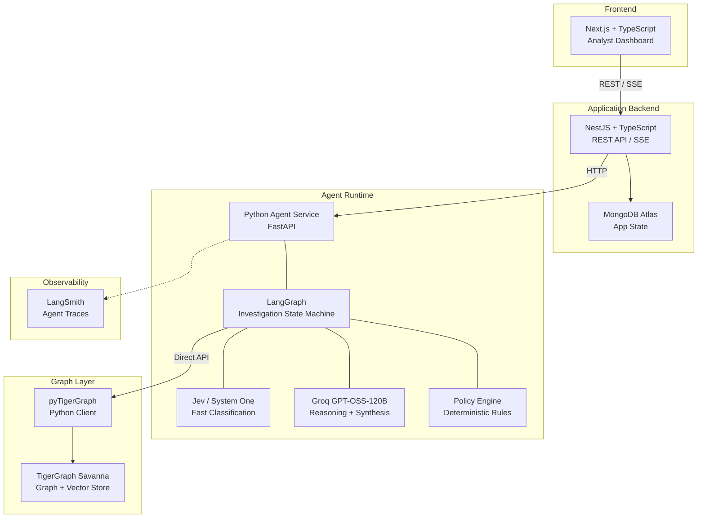

# System Architecture

> [[Home]] · [[PRD]] · [[Agent-Workflow]] · [[API]]

## Design Principles

1. **Correctness first** — fraud verdicts, policy compliance, answer-format adherence
2. **Dataset compliance** — every ID from the dataset, no invented data
3. **Explainability** — evidence provenance, rule citations, audit trail
4. **Agentic behavior** — multi-step investigation, evidence gathering loops, tool use
5. **TigerGraph-centric** — graph traversal, algorithms, GraphRAG are core, not decoration
6. **Deterministic policy** — fraud rules in code, not hidden in LLM prompts
7. **Fast implementation** — hackathon deadline; avoid unnecessary infrastructure
8. **Easy debugging** — LangSmith traces, structured outputs, clear component boundaries
9. **Simple deployment** — 3 deployable units + managed services
10. **Demo quality** — visible investigation progression, real-time updates

## Architecture Diagram



## Component Responsibilities

### Next.js Frontend
| Owns | Does NOT own |
|---|---|
| Analyst dashboard UI | Fraud investigation logic |
| Case list / detail views | Policy decisions |
| Investigation timeline display | Graph queries |
| Evidence/action display | LLM calls |
| Approval UI (approve/reject) | Agent orchestration |
| SSE consumption for live updates | Data ingestion |

### NestJS Backend
| Owns | Does NOT own |
|---|---|
| REST API for frontend | Investigation logic |
| Case CRUD in MongoDB | Graph traversal |
| Investigation run management | LLM reasoning |
| Approval workflow state | Policy evaluation |
| Evidence request tracking | Fraud classification |
| SSE endpoints for live updates | TigerGraph queries |
| Proxying investigation requests to Python agent | Answer file generation |

### Python Agent Service (FastAPI + LangGraph)
| Owns | Does NOT own |
|---|---|
| LangGraph investigation state machine | User authentication |
| Tool orchestration (TG MCP, Jev, LLM) | MongoDB app state |
| Evidence gathering and synthesis | Frontend rendering |
| Fraud pattern assessment | Case CRUD in MongoDB |
| Evidence sufficiency evaluation | Approval workflow UI |
| Policy engine (deterministic rules) | |
| SAR narrative generation (via LLM) | |
| Answer file JSON generation | |
| Case writing to TigerGraph | |

### TigerGraph (via pyTigerGraph)
| Owns | Does NOT own |
|---|---|
| Graph storage: vertices, edges, attributes | Investigation logic |
| GSQL INTERPRET queries for fraud patterns | Policy decisions |
| Graph algorithms (community detection, PageRank, etc.) | LLM reasoning |
| GraphRAG: vector search for documents/cases | Answer file generation |
| Case memory storage | |

### Jev / System One
| Owns | Does NOT own |
|---|---|
| Fast fraud pattern classification | Final fraud verdict |
| Evidence sufficiency assessment | Policy rule execution |
| Investigation routing decisions | SAR narrative |
| Coordination detection | Graph traversal |

**Critical**: Jev outputs are **signals/inputs** to the investigation, NOT ground truth. Must be validated against graph evidence and policy.

### Groq GPT-OSS-120B
| Owns | Does NOT own |
|---|---|
| Evidence synthesis / reasoning | Deterministic calculations |
| Investigation planning | Policy rule execution |
| SAR narrative generation | Approval routing |
| Case summary generation | Exposure calculation |
| Explanation generation | Evidence provenance |
| Tool selection reasoning | Graph analysis |

### MongoDB Atlas
| Owns | Does NOT own |
|---|---|
| Investigation run records | Fraud graph data |
| Approval workflow state | Transaction/customer data |
| Audit events | Graph traversal results |
| UI session state | Case memory |

### LangSmith
| Owns | Does NOT own |
|---|---|
| Agent trace collection | Application logic |
| Tool call logging | Data storage |
| Latency/token metrics | Policy decisions |
| Debugging visibility | |

## Technology Evaluation

### Required (challenge mandates)
- **TigerGraph** (Savanna or CE) — graph + vector storage
- **GSQL + graph algorithms** — traversal, pattern detection
- **pyTigerGraph** — expose graph capabilities to agent (replacing MCP for simpler deployment)
- **GraphRAG** — ground agent with relevant evidence/context
- **User interface** — demonstrate investigation

### Chosen
- **LangGraph (Python)** — state machine with tool use, conditional routing, persistence; Python chosen because pyTigerGraph is Python-native
- **Groq GPT-OSS-120B** — 131K context, structured outputs, tool use, fast inference (~500 tok/s), cheap ($0.15/$0.60 per 1M tokens)
- **Jev / System One** — fast classification/scoring for structured decisions alongside generative model
- **NestJS** — TypeScript backend, clean module/controller/service pattern for API
- **Next.js** — React SSR, already scaffolded with Tailwind
- **MongoDB Atlas** — document-shaped app data (investigation runs, approvals), free tier
- **LangSmith** — native LangGraph integration for tracing

### Explicitly NOT using
| Technology | Reason |
|---|---|
| Redis | No demonstrated caching need yet |
| Kafka | No event streaming need; adds complexity |
| Separate vector DB (Pinecone/Qdrant) | Challenge wants TigerGraph vector search |
| Custom ML model training | Risk scores already provided; investigation is the task |
| PostgreSQL/Supabase | MongoDB simpler for document-shaped app data |
| Kubernetes | Hackathon scope |
| Microservices framework | 3 simple services suffice |

## Deployment Model

```
Frontend:    Next.js → Vercel (or similar)
Backend:     NestJS → Render / Railway / Fly
Agent:       Python (FastAPI + LangGraph) → same host or separate
TigerGraph:  Savanna (managed cloud) — auto-stop/auto-start
MongoDB:     Local instance (due to network restrictions) or Atlas
Groq:        Cloud API
Jev:         Cloud API
LangSmith:   Cloud
```

**3 things to deploy**: Next.js, NestJS, Python Agent.
Everything else is external managed service.

## Communication Patterns

```
Frontend ←→ NestJS:        REST + SSE (investigation progress)
NestJS  → Python Agent:    HTTP POST (trigger investigation, get results)
Python Agent → pyTigerGraph: Direct HTTP requests to Savanna
Python Agent → Groq:       OpenAI-compatible API
Python Agent → Jev:        Jev SDK / API
Python Agent → LangSmith:  Automatic via LangGraph callbacks
```

## Cross-References

- API contract details: [[API]]
- Agent state machine: [[Agent-Workflow]]
- Graph schema: [[Data-Model]]
- Policy rules: [[Policy-Engine]]
- LLM responsibilities: [[LLM]]
- Jev responsibilities: [[Jev]]
