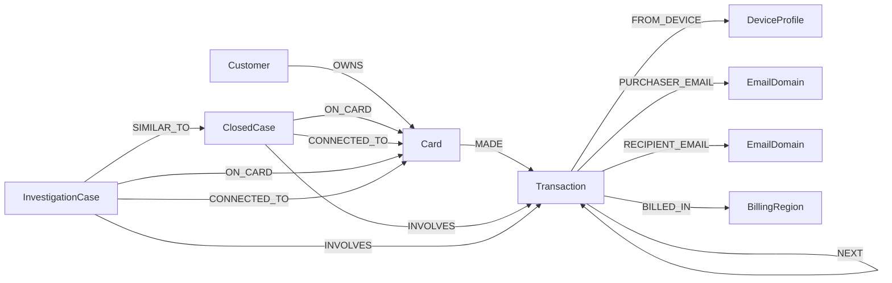

# Data Model — TigerGraph Schema

> [[Home]] · [[Architecture]] · [[TigerGraph]] · [[Agent-Workflow]]

## Schema Overview

Based on the suggested schema in `Initial-docs/dataset/README (1).md`, extended with investigation-specific additions.

## Vertices

### Customer
| Attribute | Type | Source |
|---|---|---|
| `customer_id` (PRIMARY ID) | STRING | `transactions.csv` → `customer_id` (e.g. `C01234`) |

### Card
| Attribute | Type | Source |
|---|---|---|
| `card_id` (PRIMARY ID) | STRING | Derived: `customer_id + "-K" + card_index` (e.g. `C01234-K1`) |
| `card1` | INT | Card issuer field |
| `card2` | FLOAT | Card field 2 |
| `card3` | FLOAT | Card field 3 |
| `card4` | STRING | Network: visa, mastercard, american express, discover |
| `card5` | FLOAT | Card field 5 |
| `card6` | STRING | Type: credit, debit |

### Transaction
| Attribute | Type | Source |
|---|---|---|
| `txn_id` (PRIMARY ID) | STRING | `TransactionID` |
| `ts` | DATETIME | `ts` column (YYYY-MM-DD HH:MM:SS) |
| `amount` | FLOAT | `TransactionAmt` |
| `product_cd` | STRING | `ProductCD` (W, C, H, R, S) |
| `channel` | STRING | `channel` (in_person, online) |
| `risk_score` | FLOAT | `risk_score` (0–1) |
| `addr1` | FLOAT | Billing region code |
| `addr2` | FLOAT | Billing country code |
| `dist1` | FLOAT | Distance 1 |
| `dist2` | FLOAT | Distance 2 |
| `transaction_dt` | INT | `TransactionDT` (seconds from dataset start) |
| `C1` through `C14` | FLOAT | Count features (store as JSON blob or selected) |
| `D1` through `D15` | FLOAT | Time delta features (store as JSON blob or selected) |
| `M1` through `M9` | STRING | Match flags |

> **Decision**: Store V1–V339 as a JSON blob attribute on Transaction, NOT as individual attributes or vertices. They're unnamed engineered features used as signals. Loading all 339 as separate attributes would bloat the schema for minimal investigation value. The agent can access specific V-columns when needed from the blob.

### DeviceProfile
| Attribute | Type | Source |
|---|---|---|
| `device_profile_id` (PRIMARY ID) | STRING | Composite: `DeviceInfo + " | " + OS + " | " + browser + " | " + screen` |
| `device_type` | STRING | `DeviceType` (mobile, desktop) |
| `device_info` | STRING | `DeviceInfo` (e.g. `SAMSUNG SM-G892A Build/NRD90M`) |
| `os` | STRING | `id_30` |
| `browser` | STRING | `id_31` |
| `screen` | STRING | `id_33` |
| `id_15` | STRING | Device status: New, Found, Unknown |
| `id_23` | STRING | Proxy: transparent, anonymous, hidden |

### EmailDomain
| Attribute | Type | Source |
|---|---|---|
| `email_domain` (PRIMARY ID) | STRING | `P_emaildomain` or `R_emaildomain` |

### BillingRegion
| Attribute | Type | Source |
|---|---|---|
| `region_id` (PRIMARY ID) | STRING | `addr1` value as string |
| `country_code` | FLOAT | `addr2` (87 = home country) |

### ClosedCase
| Attribute | Type | Source |
|---|---|---|
| `case_id` (PRIMARY ID) | STRING | `case_id` from closed_cases_history.csv |
| `customer_id` | STRING | |
| `card_id` | STRING | |
| `opened_at` | DATETIME | |
| `closed_at` | DATETIME | |
| `outcome` | STRING | `confirmed_fraud` or `cleared` |
| `pattern` | STRING | One of the 7 pattern values or `none` |
| `first_fraud_txn_id` | STRING | |
| `n_txns` | INT | |
| `exposure_usd` | FLOAT | |
| `actions_taken` | STRING | Pipe-separated |
| `report_filed` | STRING | Yes/No |
| `analyst_notes` | STRING | Full narrative — **load into vector store** |

### InvestigationCase (agent-created)
| Attribute | Type | Source |
|---|---|---|
| `case_id` (PRIMARY ID) | STRING | e.g. `CASE-2016-XXXX` |
| `source_case_id` | STRING | e.g. `HHG-001` |
| `status` | STRING | open, closed_fraud, closed_legitimate, escalated |
| `verdict` | STRING | fraud, legitimate, uncertain |
| `fraud_probability` | FLOAT | |
| `pattern` | STRING | |
| `exposure_usd` | FLOAT | |
| `summary` | STRING | |
| `created_at` | DATETIME | |

## Edges

| Edge | From | To | Attributes | Cardinality |
|---|---|---|---|---|
| `OWNS` | Customer | Card | — | 1:N |
| `MADE` | Card | Transaction | — | 1:N |
| `FROM_DEVICE` | Transaction | DeviceProfile | `id_15` (New/Found) | N:1 (online only) |
| `PURCHASER_EMAIL` | Transaction | EmailDomain | — | N:1 |
| `RECIPIENT_EMAIL` | Transaction | EmailDomain | — | N:1 (if R_emaildomain exists) |
| `BILLED_IN` | Transaction | BillingRegion | — | N:1 |
| `NEXT` | Transaction | Transaction | — | 1:1 (ordered by `ts` within card) |
| `INVOLVES` | ClosedCase | Transaction | — | 1:N |
| `ON_CARD` | ClosedCase | Card | — | 1:1 |
| `CONNECTED_TO` | ClosedCase | Card | — | 1:N |
| `INVOLVES` | InvestigationCase | Transaction | — | 1:N |
| `ON_CARD` | InvestigationCase | Card | — | 1:1 |
| `CONNECTED_TO` | InvestigationCase | Card | — | 1:N |
| `SIMILAR_TO` | InvestigationCase | ClosedCase | — | N:N |

## Data Loading Plan

### Phase 1: Core entities
1. Load `Customer` vertices from distinct `customer_id` in transactions.csv
2. Load `Card` vertices from distinct `card_id` in case_pack.csv + closed_cases_history.csv + derive from transactions
3. Load `Transaction` vertices from transactions.csv (590K rows, selective attributes)
4. Create `OWNS` edges (customer → card)
5. Create `MADE` edges (card → transaction)

### Phase 2: Identity/device layer
6. Load `DeviceProfile` vertices from distinct device composites in identity.csv
7. Load `EmailDomain` vertices from distinct P_emaildomain, R_emaildomain
8. Load `BillingRegion` vertices from distinct addr1 values
9. Create `FROM_DEVICE` edges (transaction → device, online only)
10. Create `PURCHASER_EMAIL`, `RECIPIENT_EMAIL` edges
11. Create `BILLED_IN` edges
12. Create `NEXT` edges (ordered by ts within each card)

### Phase 3: Case memory
13. Load `ClosedCase` vertices from closed_cases_history.csv
14. Create `INVOLVES` edges (case → transactions, parse pipe-separated txn_ids)
15. Create `ON_CARD` edges (case → card)
16. Create `CONNECTED_TO` edges (case → connected cards, parse connected_card_ids)

### Phase 4: Vector index
17. Load analyst_notes from closed cases into TigerGraph vector store
18. Load fraud policy text into vector store
19. Load pattern descriptions into vector store

## Key Relationships for Investigation

| Investigation Question | Graph Query Pattern |
|---|---|
| What is this customer's transaction history? | Customer → OWNS → Card → MADE → Transaction |
| What device was used? | Transaction → FROM_DEVICE → DeviceProfile |
| What other cards share this device? | DeviceProfile ← FROM_DEVICE ← Transaction ← MADE ← Card |
| Is this a new region for this customer? | Card → MADE → Transaction → BILLED_IN → BillingRegion (check history) |
| Card testing sequence? | Card → MADE → Transaction → NEXT → Transaction (check amounts/timing) |
| Similar past cases? | ClosedCase → ON_CARD → Card, ClosedCase → INVOLVES → Transaction |
| Cross-customer fraud ring? | DeviceProfile ← FROM_DEVICE ← Transaction ← MADE ← Card ← OWNS ← Customer |

## Deriving `card_id` from transactions.csv

The dataset README says: `customer_id` is like `C01234`, and card IDs look like `C01234-K1`.

**card_id derivation**: Group transactions by `customer_id` + `card1` (card issuer field). Each unique combination gets a sequential K-index. Cross-reference with card_ids appearing in case_pack.csv and closed_cases_history.csv to ensure consistency.

> **Decision required**: The exact mapping from `card1` field to card_id suffix needs verification during data loading. The closed_cases_history.csv and case_pack.csv already contain explicit card_ids. The ingestion script must reconcile these.

## Cross-References

- TigerGraph setup and queries: [[TigerGraph]]
- How agent uses these queries: [[Agent-Workflow]]
