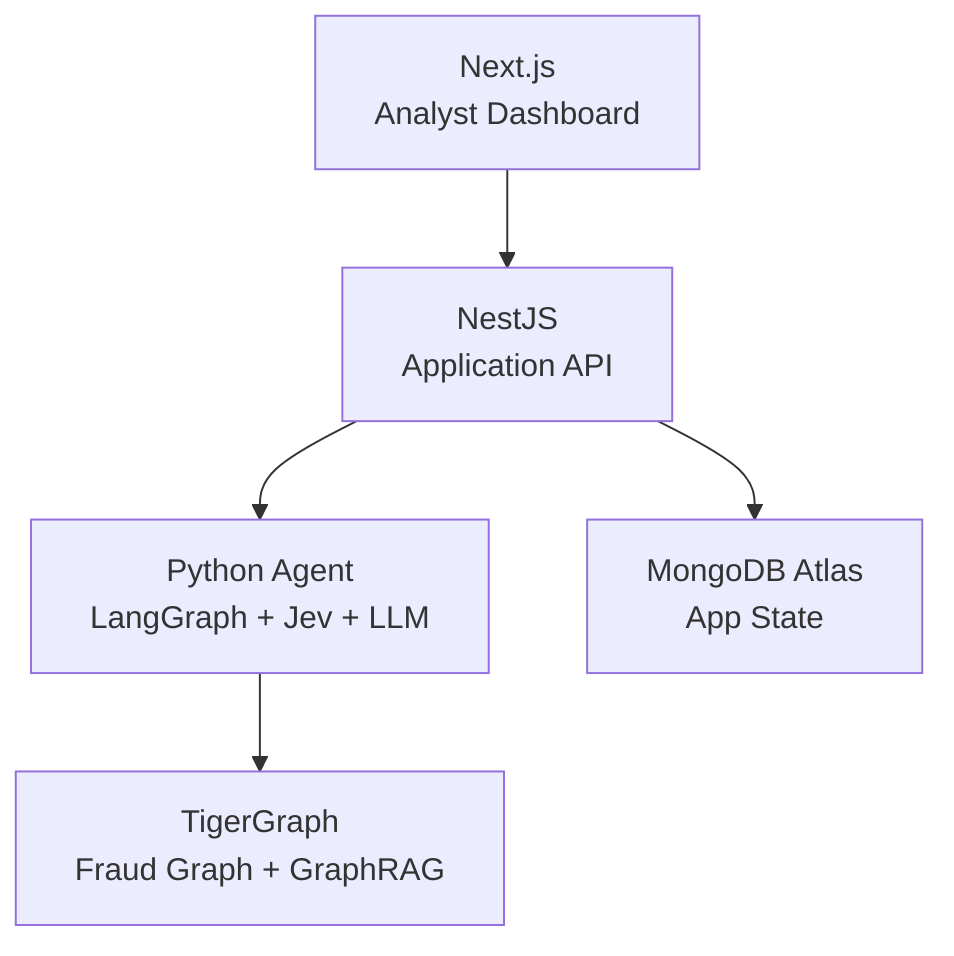

# 🏠 Fraud Investigation Agent — Project Index

> **TigerGraph × Hacker House Goa 2026** — Agentic Fraud Investigation System
> Deadline: September 24, 2026

## Quick Links

| Document | Purpose |
|---|---|
| [[PRD]] | Product requirements derived from challenge brief |
| [[Architecture]] | System architecture and component responsibilities |
| [[Agent-Workflow]] | Investigation state machine and LangGraph design |
| [[Data-Model]] | TigerGraph schema, vertices, edges, attributes |
| [[TigerGraph]] | TigerGraph setup, GSQL queries, MCP, GraphRAG |
| [[API]] | NestJS ↔ Python Agent ↔ Frontend contract |
| [[UI]] | Analyst dashboard pages, components, layout |
| [[Policy-Engine]] | Deterministic fraud policy rules R1–R10 |
| [[LLM]] | GPT-OSS-120B responsibilities and structured outputs |
| [[Jev]] | System One fast classification/routing layer |
| [[Development-Plan]] | Phased implementation roadmap |
| [[Implementation-Tasks]] | Ordered task list with acceptance criteria |
| [[Decisions]] | Architectural decisions and rationale |
| [[Questions]] | Open questions requiring resolution |
| [[Plan-Validation]] | Consistency check and risk assessment |
| [[Audit]] | Full project audit vs problem statement (2026-09-23) |
| [[Demo-Video]] | 3–5 min demo video script (judging-aligned) |

## Architecture Overview

## Dataset Files (DO NOT MODIFY)

| File | Records | Size |
|---|---|---|
| `transactions.csv` | 590,742 | ~708 MB |
| `identity.csv` | 144,432 | ~27 MB |
| `closed_cases_history.csv` | 5,565 | ~2.7 MB |
| `case_pack.csv` | 20 | ~3.5 KB |

## Judging Criteria

| Category | Weight |
|---|---:|
| Investigation accuracy | **25%** |
| Next best action | **25%** |
| Case summary + explainability | 10% |
| Agentic design + engineering | 15% |
| Innovation | 15% |
| Demo quality + completeness | 10% |
